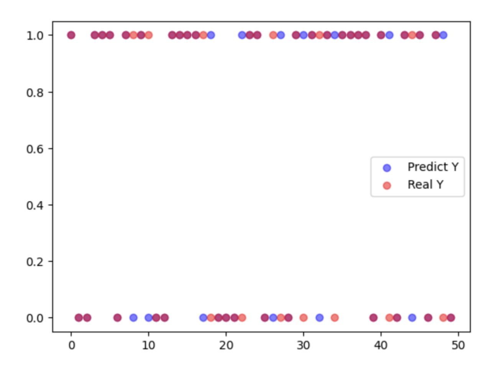

# M2_DecisionTreeClassifier
En el repositorio se encuentra en documento smoking_driking_dataset_Ver01.csv el cual fue sacado de un Dataset de Kaggle, el documento main.py que contiene el codigo de python para correr el modelo de árbol de desición para clasificación de nuestros datos y por ultimo decistion_tree.png que es la imagen del modelo del árbol de desición.

**Nota:** El archivo csv esta comprimido en un Zip, es importante que antes de correr el programa se descomprima el archivo para no tener ningun problema al momento de correrlo

## Acerca del Dataset
Este conjunto de datos  obtenido de Kaggle se recopilo del Servicio Nacional de Seguro Médico de Corea. Se excluyó toda la información personal y los datos sensibles.
El propósito de este conjunto de datos es:
* Análisis de la señal corporal.
* Clasificación de fumador o bebedor
  
En este analisis solo clasificaremos si la persona es bebedor o no por lo que la variable SMK_stat_type_cd no se utilizo

**Variables**
* sex:male, female
* age:edad de la persona 
* height
* weight
* sight_left:nivel de vista (izquierda)
* sight_right:nivel de vista (derecha)
* hear_left:audición izquierda, 1(normal), 2(anormal)
* hear_right:audición derecha, 1(normal), 2(anormal)
* SBP:Presión arterial sistólica [mmHg]
* DBP:Presión arterial diastólica [mmHg]
* BLDS:Glucosa en sangre en ayunas [mg/dL]
* tot_chole:colesterol total[mg/dL]
* HDL_chole:Colesterol HDL[mg/dL]
* LDL_colesterol Colesterol LDL[mg/dL]
* triglyceride: triglicérido [mg/dL]
* hemoglobin: hemoglobina [g/dL]
* urine_protein:proteína en la orina, 1(-), 2(+/-), 3(+1), 4(+2), 5(+3), 6(+4)
* serum_creatinine: creatinina sérica(sangre)[mg/dL]
* SGOT_AST: Glutamato-oxalacetato transaminasa
* AST: Aspartato transaminasa[UI/L]
* SGOT_ALT: Alanina transaminasa[UI/L]
* gamma_GTP: y-glutamil transpeptidasa[UI/L]
* SMK_stat_type_cd: Estado de fumar, 1 (nunca), 2 (solía fumar pero lo dejó), 3 (todavía fuma)
* DRK_YN Bebedor o no
  
## Acerca del Documento de Python 
 El codigo contiene la implementación de un algoritmo de clasificación utilizando un árbol de desición utilizando la  biblioteca de sklearn y graphviz para el procesamiento y modelado de los datos.
 Para este ejemplo se utilizaron un nivel de profundidad de 5 para nuestro árbol y utilizamos 990000 datos para el entrenamiento del modelo y al finalizar se realizo una prueba con un fragmento del set de datos original de 50 datos para realiza algunas predicciones, para poder comparar las predicciónes del modelo con los datos reales.
Los resultados de accuracy , que es el porcentaje de casos que el modelo ha acertado, tanto con los datos de train como test son los siguientes:

## Análisis y Reporte sobre el desempeño del modelo.
Para entrenar el modelo utilizaremos árboles de decisión, en este caso utilizaremos 5 niveles de profundidad para nuestro modelo.Para poder saber el accuracy, en este caso como nuestro modelo es de clasificación el accuracy nos dice  qué porcentaje de los datos está clasificando  nuestro modelo de manera correcta.

Para nuestros valores de prueba utilizaremos 990000 datos:
El  número de datos por categoría que tenemos en el Train es de 1: 494786 y  0: 495214, donde 1 significa que la persona es bebedora y 0 es que no  y nuestro porcentaje de accuracy es de 70.40 %

Para nuestro Test utilizaremos 50 datos: 
El  número de datos por categoría que tenemos en el Train es de 1: 29 y  0: 21,nuestro porcentaje de accuracy es de 74%, para analizar un poco mejor los resultados de nuestros resultados en test utilizaremos la matriz de confusión:

|               | Predict 0     | Predict 1     |
| ------------- | ------------- |-------------  | 
| Real 0        | 14            | 7             | 
| Real 1        | 6             | 23            |

En esta tabla podemos ver que efectivamente los valores que está prediciendo correctamente  son 37 lo que corresponde a nuestro 74% de nuestros 50 datos , si bien la diferencia entre el número de datos no es diversa esto permite que nuestro modelo no le de más peso a una categoría que a otra.
La precisión, es decir cuando el valor es de una categoría cuántas veces es correcta, para cada uno de los valores es la siguiente:
* Para 0: 70%
* Para 1: 76.6%

Podríamos pensar que el modelo predice mejor el valor de 1 pero esto solo se debe a que para el train tenemos más valores de la clase 1, pero la diferencia no es tan significativa.

Por último haremos cross validation con 10 splits donde Iteramos 10  veces:
1. Apartaremos 1/10 de muestras, es decir 99135.
2. Entrenamos al modelo con el restante 9/10 de muestras = 892212
3. Mediremos el accuracy obtenido sobre las 99135. que habíamos apartado.
   
Esto quiere decir que hacemos 10 entrenamientos independientes. A continuación se muestra la lista de resultados del accuracy para cada muestra:
0.70304131, 0.7070863 , 0.70156857, 0.70422152, 0.70160892, 0.70632975, 0.70458168, 0.70314927, 0.70232211, 0.70443037

Como podemos ver todas las pruebas están teniendo un resultado de desempeño similar, dejando el promedio de nuestro cross-validation en un 70% de accuracy.

El sesgo de nuestro modelo es medio, ya que podemos ver que el error que presenta en Test, Train y Cross validation es de aproximadamente 30% - 35% lo cual si bien nos da la mayoría de los datos de forma correcta aun podemos ver datos que no se están prediciendo bien como se muestra en la gráfica de Train.

Ahora bien veamos que la varianza en nuestros datos es baja ya que tanto Train, Test como Cross validation están teniendo valores de accuracy entre 70% y 75% sin dejar ver una diferencia muy grande en estos datos. 

Dicho lo anterior podríamos decir que el ajuste de nuestro modelo es de underfit ya que la varianza de los datos es baja sin embargo el sesgo es un poco alto y debemos tratar de reducirlo para poder tener mejores resultados de nuestro modelo . El underfit se da cuando un modelo es demasiado simple para capturar la complejidad de los datos, en este punto se puede deber a que estamos trabajando con 21 features o parámetros  para nuestro modelo de clasificación lo que resultó en un rendimiento deficiente tanto en los datos de entrenamiento como en los de prueba con un accuracy de 70% aproximadamente.

